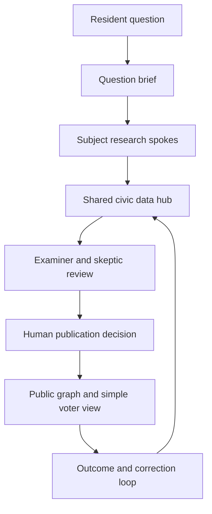

# Cleveland Civic Intelligence Bench

## Purpose

The Cleveland Civic Graph should use Data-Smart’s civic-intelligence approach as a research and operating model while keeping the public product resident-first. Data-Smart describes three useful patterns: start with the resident journey, maintain shared data definitions, and connect central standards with subject-matter teams close to the work. Their Cleveland data-governance example describes this as a hub-and-spoke model. Their civic-data catalogue turns city problems into concrete questions that can be answered with evidence. Their performance work follows the chain from a service or policy intervention to measurable outcomes.

The Civic Intelligence Bench adapts those patterns to a public, question-led civic graph. It is a governed research bench, not an autonomous publisher.

## The operating model

The resident begins with a question such as “Who can change my electric bill?” or “What happens if I vote yes on this levy?” The system creates a bounded research brief. Energy, education, elections, courts, housing, contracts and other subject spokes do the domain work. The shared hub enforces common identifiers, dates, jurisdiction, relationship types, source records and evidence states. The examiner checks the work in isolation. The skeptic can block a proposal or require a dissent note. A human publisher approves or rejects the proposed change. The public graph shows the result with source links, uncertainty and a plain-language explanation. Later records can update the outcome or issue a correction.

## The council

| Seat | Responsibility | Public accountability |
| --- | --- | --- |
| Question Framer | Converts a resident need into a narrow question and scope | Publishes the question and exclusions |
| Source Scout | Finds primary laws, dockets, contracts, budgets, roll calls, meeting records and official data | Records source URL, date retrieved and document identity |
| Examiner | Tests jurisdiction, identity, chronology, legal role, source fit and duplicate records | Produces an examination report separate from the researcher |
| Evidence Registrar | Attaches citations, evidence state, confidence, review date and plain-language explanation | Makes evidence coverage visible |
| Graph Modeler | Proposes entities and typed relationships | Must state whether a relationship is authority, ownership, administration, contract, money, operation, oversight, vote or interpretation |
| Outcome Tracker | Follows a proposal through decision, appropriation, contract, implementation and result | Labels scenarios and measured outcomes separately |
| Skeptic | Searches for counterevidence, ambiguity, stale records and unsupported causal claims | Can veto public commit and must leave a reason |
| Memory Registrar | Keeps append-only proposals, corrections, dissent and source hashes | Maintains the history of what changed and why |
| Human Publisher | Reviews the entire packet and commits the public graph change | The only role allowed to publish |

Subject spokes are not additional publishers. They are bounded research teams that return evidence packets to the hub. A spoke can include election records, city council, energy, education, public safety, housing, health, transit, courts, county, Ohio and federal researchers. Institutional participants can contribute records and corrections, but the community data layer remains open and is not owned by one institution.

## The shared civic data contract

Every public record needs:

- stable identifier and record type;
- source URL, source title or document identity, retrieval date and publication date when available;
- jurisdiction, geographic scope and valid dates;
- the exact relationship or claim being made;
- evidence state: verified, partial, contested, stale or missing;
- confidence and a short reason for that confidence;
- plain-language explanation for a resident;
- review history, corrections and dissent;
- distinction between legal authority, administration, ownership, contract, money, operations, regulation, political influence, recorded vote, statement and inference.

The system must never use a party label as a substitute for evidence. It must never convert map proximity, sponsorship, membership, a campaign statement or one vote into an overall ideology score. A missing record is a missing record. “Not applicable to this office” is different from “not yet reviewed.”

## Research packet and review gates

An agent may produce a shadow proposal containing a question, scope, source hashes, records, proposed relationships, rationale and known gaps. The proposal moves through these gates:

1. **Shadow:** work is isolated and cannot affect the public graph.
2. **Examined:** the examiner checks identity, scope, jurisdiction, dates, source fit and relationship type.
3. **Challenged:** the skeptic records counterevidence, ambiguity or a veto. The proposal must retain dissent even when it advances.
4. **Approved:** a named human reviewer accepts the packet, its uncertainty and its dissent record.
5. **Committed:** the deterministic publisher writes the approved change and an append-only decision record.

The `app/civic-intelligence.ts` module defines this contract. Agent roles cannot publish. A proposal cannot commit without a human reviewer, source hashes, at least one change, a source URL for every change, a rationale, and either a dissent note or an explicit no-dissent review. Missing evidence cannot be published as a verified relationship.

## Resident journeys over organization charts

The graph should keep its map-first visual identity, but the entry point should be a question. The primary paths are:

- **Understand:** “Who decides this?”
- **Compare:** “What did each person actually vote for or say?”
- **Practice:** “What would my ballot choices mean?”
- **Trace:** “Where does the money, contract or authority go?”
- **Follow through:** “What happened after the decision?”
- **Correct:** “This record is wrong or out of date.”

Each path should offer Simple Voter, Explore, Audit, text and low-bandwidth views. The map is a way to follow the explanation, not a requirement for understanding it.

## Data-Smart ideas to adopt directly

1. **Resident journey:** test every flow with “Can a person find, understand and use this without insider knowledge?”
2. **Hub and spokes:** centralize identifiers, metadata, source and review rules; keep domain judgment near the subject.
3. **Shared definitions:** maintain a civic dictionary and relationship vocabulary before adding more agents or data feeds.
4. **Question catalogue:** turn resident needs into a backlog of answerable Cleveland questions, with scope and outcome measures.
5. **Outcome measurement:** connect promise → official decision → appropriation or contract → implementation → resident outcome → measured result.
6. **Process diagnosis:** when records do not connect, decide whether the problem is missing data, a broken workflow, an unclear authority chain or all three.
7. **Missing voices check:** every brief asks which residents, neighborhoods, agencies or affected groups are absent from the evidence.
8. **Build standards early:** source and identifier requirements belong in data-sharing agreements and procurement requests before new feeds are accepted.

## What this enables for Cleveland

The first subject spokes should be:

- elections and representation;
- city council, wards and ordinances;
- energy, utility rates, plants and contracts;
- schools, boards, levies and district governance;
- housing, land use, permits and court pathways;
- public safety and oversight;
- budgets, procurement, bonds and contracts;
- health, environment, mobility and transit;
- county, Ohio and federal connections.

Each spoke should ship a small, reviewable question set. For energy, an initial question is “Who owns the plant, who has the contract, who dispatches the power, who regulates it, and what did the approving body vote on?” For education, it is “Who sets the district policy, who controls the budget, who appoints or elects the board, and what can a levy change?”

## Metrics

Measure the civic service rather than agent activity alone:

- time for a new voter to identify the office or proposal;
- percentage of records with a primary source and review date;
- percentage of relationships with a clear type and jurisdiction;
- percentage of proposals with a recorded skeptic review and dissent status;
- correction time from resident report to reviewed disposition;
- percentage of questions answered in Simple Voter mode without opening the audit view;
- number of “not applicable,” “missing” and “contested” records shown honestly;
- outcome coverage from promise through implementation and measured result;
- participation across neighborhoods and groups, including people who do not usually attend public meetings.

These metrics are service measures, not scores for officials, neighborhoods or political identities.

## Implementation sequence

### Now

- Keep the current practice ballot, source registry, dictionary, evidence labels and right-side record drawer.
- Add the Bench contract and proposal state machine to the project.
- Create one question catalogue for Cleveland and one data dictionary for entity, relationship, scope, source and outcome fields.
- Keep all agent output shadow-only.

### Next

- Build a small review console for proposals, source packets, dissent and corrections.
- Add public correction intake without allowing direct graph mutation.
- Expand the election, council, energy and education spokes with primary records.
- Add outcome records for a few completed Cleveland decisions before broadening the graph.

### Later

- Add scheduled source refreshes with change detection.
- Add institutional contribution workflows with the same evidence and review gates.
- Add neighborhood listening and missing-constituency review.
- Add Spanish-reviewed language, screen-reader testing, mobile testing and community usability sessions.

The result is a civic-intelligence layer that learns from Data-Smart’s research practice while preserving the project’s resident-first promise, open community orientation and human-controlled governance.
